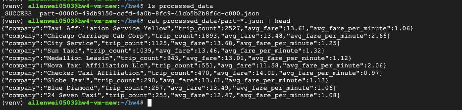

# HW4 - Data Processing and Query

## VM Information
Public IP: 34.27.133.37

## Part 2.1 Screenshot

Below is the screenshot showing the contents of the `processed_data/` folder, including the `_SUCCESS` file and a sample part file output.

Example output:

{"company":"Taxi Affiliation Service Yellow","trip_count":2527,"avg_fare":13.61,"avg_fare_per_minute":1.06}
{"company":"Chicago Carriage Cab Corp","trip_count":1893,"avg_fare":13.48,"avg_fare_per_minute":2.66}
{"company":"City Service","trip_count":1125,"avg_fare":13.68,"avg_fare_per_minute":1.25}
{"company":"Sun Taxi","trip_count":1039,"avg_fare":13.46,"avg_fare_per_minute":1.32}
{"company":"Medallion Leasin","trip_count":943,"avg_fare":13.01,"avg_fare_per_minute":1.12}
{"company":"Nova Taxi Affiliation Llc","trip_count":551,"avg_fare":11.58,"avg_fare_per_minute":2.06}
{"company":"Checker Taxi Affiliation","trip_count":470,"avg_fare":14.01,"avg_fare_per_minute":0.97}
{"company":"Globe Taxi","trip_count":290,"avg_fare":13.61,"avg_fare_per_minute":1.13}
{"company":"Blue Diamond","trip_count":257,"avg_fare":13.49,"avg_fare_per_minute":1.06}
{"company":"24 Seven Taxi","trip_count":255,"avg_fare":12.47,"avg_fare_per_minute":1.08}